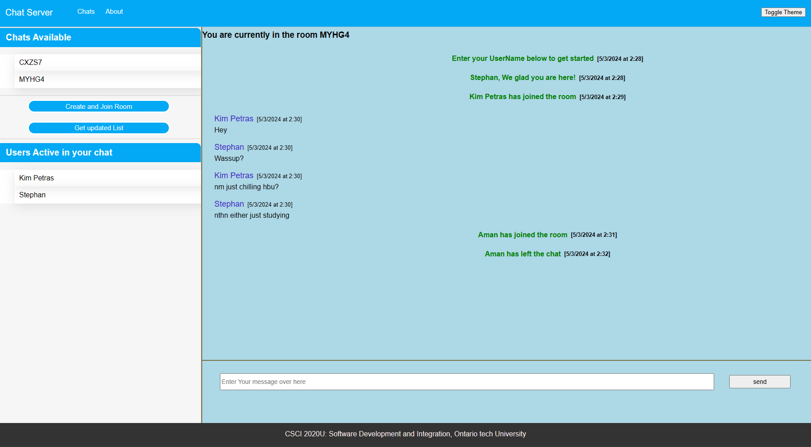
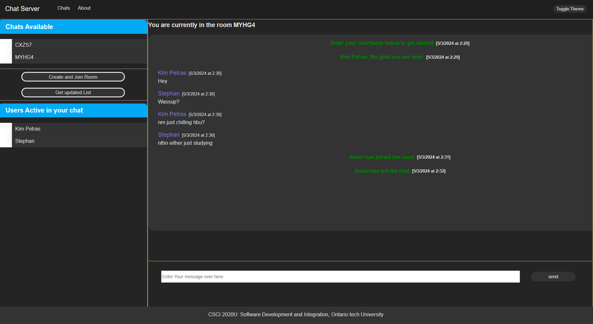
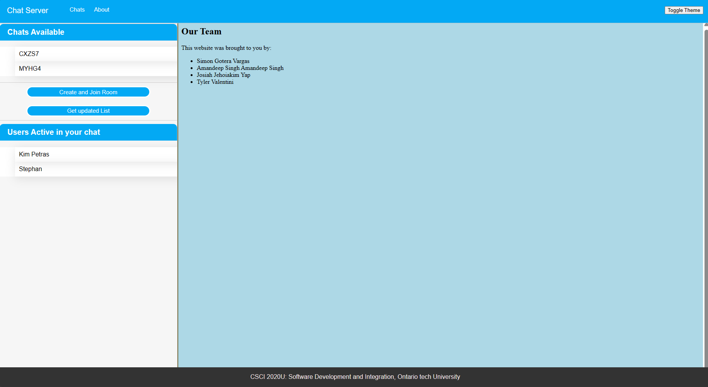

# WebSocket Chat Server

[[Click to watch demonstration video]](https://drive.google.com/file/d/1JkhwsAqloMuNwwxwfC-CSqSr8mE20izE/preview)

## Project Information
- **Course**: CSCI 2020U: Software Systems Development and Integration

- **Client Side:**S
    - Uses JavaScript, css, HTML
    - Connects to a WebSocket server.
    - Users can join existing chat rooms or create their own.
    - Send and receive messages in real-time.
    - Toggle between dark and light modes for the UI.
- **Server Side:**
    - Uses Java
    - WebSocket server for handling real-time messaging.
    - Servlets for providing active user info, existing rooms
    - Manages connections, messages, and room memberships.

## Group Members (Contribution)
- Amandeep Singh (25%)
- Simon Gotera Vargas (25%)
- Josiah Jehoiakim Yap  (25%)
- Tyler Valentini  (25%)

## Improvements

- ### Interaction
  - Send Message Button: Added a dedicated "Send Message" button for ease of use. Users can now click the "Send Message" button to quickly send messages in the chat room.
  - Active Users List: Implemented a feature to display the list of active users in the chat room. Users can now see who is currently online and actively participating in the chat.
  - Room List as Buttons: Introduced room list as clickable buttons for seamless navigation. Users can easily enter different chat rooms by clicking on the respective room buttons.

- ### User Interface Improvements
  - Different Message Styles: Messages now display entering or leaving users in a different font style, making it easier to distinguish between different types of messages.
  - Dark/Light Theme Button: Added a toggle button to switch between dark and light themes for the UI. Users can now customize the chat room interface based on their preference.
  - Hover Effects: Applied hover effects to almost all UI buttons and elements, improving the overall aesthetic and interactivity of the chat room.
  - Date Display for Messages: Messages now include date and timestamps, providing users with context on when each message was sent.
  - Centered Joining and Leaving Messages: Joining and leaving messages are now displayed in the center of the chat window, ensuring they are prominently visible to all users.
  

## How to Run the Project Locally

- ####  Download GlassFish Server
    - Download and install GlassFish Server from the official website or a trusted source.

- #### Open Project in IntelliJ
    - Open IntelliJ IDEA and load the project containing the server-side code.

- ####  Edit configuration
    - In IntelliJ, go to file -> edit configuration and set up maven project to deploy WAR exploded locally.

- #### Deploy Locally
    - Deploy the generated WAR file to GlassFish Server by clicking on run project button on top.
    - Add Multiple tabs using URl in browser to see all the function
    - Project can be deployed remotely to uses it for inter device communication

## Other Resources
  - Some boilerplate code was provided by instructor.

