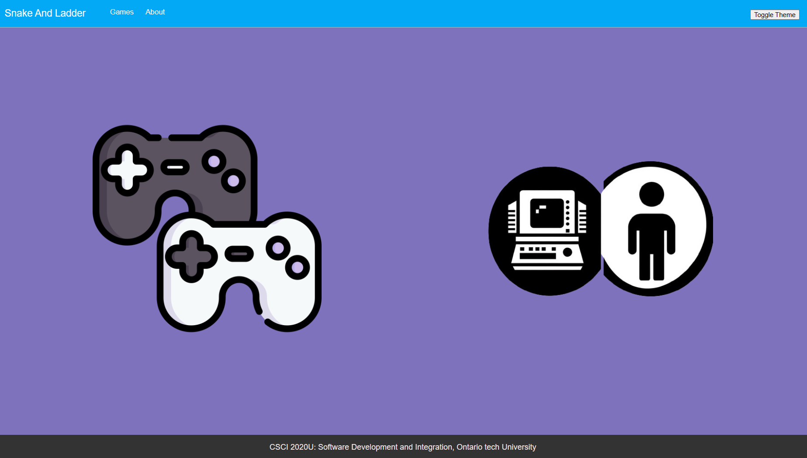
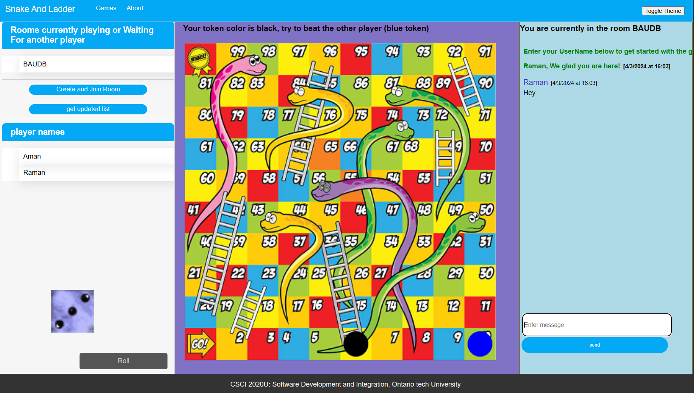
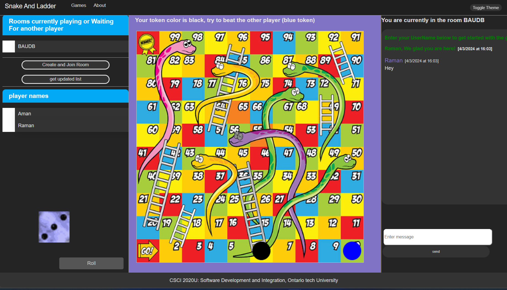
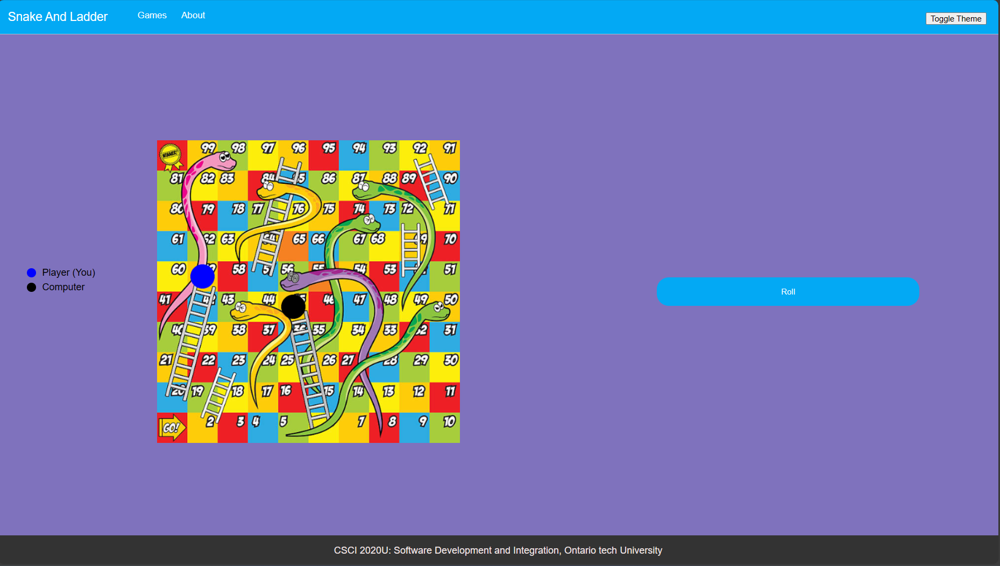

# Snake and Ladder multiplayer game 
[[Click to watch demonstration video]](https://drive.google.com/file/d/1Kbll2wJB0FjUMBdFWRSbpahJgDhwI7sx/view?usp=drive_link)

## Project Information
- **Course**: CSCI 2020U: Software Systems Development and Integration

- **Client Side:**
    - Uses JavaScript, css, HTML
    - Player can decide to play snake and ladder with computer or can play in multiplayer mode (it supports two player per game)
    - Connects to a WebSocket server and share data in two ways:
      - regular chats happening in multiplayer games
      - steps sizes for each player to update the UI for other player playing the game.
    - Users can join existing game rooms or create their own.
    - Send and receive messages in real-time along with the step size using single websocket.
    - Toggle between dark and light modes for the UI.
- **Server Side:**
    - Uses Java
    - WebSocket server for handling real-time messaging.
    - Servlets for providing active user info, existing rooms
    - Manages connections, messages, and room memberships.
    - The backend code is improved from the assignment 2 code.

## Group Members (Contribution)
- Amandeep Singh (25%)
- Simon Gotera Vargas (25%)
- Josiah Jehoiakim Yap  (25%)
- Tyler Valentini  (25%)

## Course concepts used in the projects

- ### Game Logic and Communication
  - Used websockets for interacting and sharing game updates.
  -  Implemented a feature to display the name of active players in the game using servlets. 
  - Room List as Buttons: Introduced room list as clickable buttons for seamless navigation. Users can easily enter different chat rooms by clicking on the respective room buttons. This also use servlets as well.
  - The server checks the number of people in the room to allow only two people in game and after someone leaves. If they are the last person, the room will automatically be deleted.
  - Used object-oriented programming to use code from same class for Game Logic for single Player and multiplayer games.

- ### User Interface
    - Created an interactive user interface which will let you chat and play game at the same time in multiplayer games.
    - Used canvas to Show the game board and change player positions
    - Used canvas to show rolling number in multiplayer game.
    - Interactive roll button in both games, which will be disabled if it's not player's turn
    - Different Message Styles: Messages now display entering or leaving users in a different font style, making it easier to distinguish between different types of messages.
    - Dark/Light Theme Button: Added a toggle button to switch between dark and light themes for the UI. Users can now customize the chat room interface based on their preference.
    - Hover Effects: Applied hover effects to almost all UI buttons and elements, improving the overall aesthetic and interactivity of the game.
    - Date Display for Messages: Messages now include date and timestamps, providing users with context on when each message was sent.
    - Centered Joining and Leaving Messages: Joining and leaving messages are now displayed in the center of the chat window, ensuring they are prominently visible to all users.
  

## How to Run the Project Locally

- ####  Download GlassFish Server
    - Download and install GlassFish Server from the official website or a trusted source.

- #### Open Project in IntelliJ
    - Open IntelliJ IDEA and load the project containing the server-side code.

- ####  Edit configuration
    - In IntelliJ, go to file -> edit configuration and set up maven project to deploy WAR exploded locally.

- #### Deploy Locally
    - Deploy the generated WAR file to GlassFish Server by clicking on run project button on top.
    - Add Multiple tabs using URl in browser to see all the function
    - Project can be deployed remotely to uses it for inter device communication

## Other Resources
  - Some code is reused from assignment 2 provided by instructor.
  - Some references and ideas on how to code game logic elements are taken from here https://www.geeksforgeeks.org/snake-ladder-problem-2/
  - Took idea and inspiration for the sprite animation from https://mr-easy.github.io/2017-06-26-creating-spritesheet-animation-in-html5-canvas-using-javascript/

